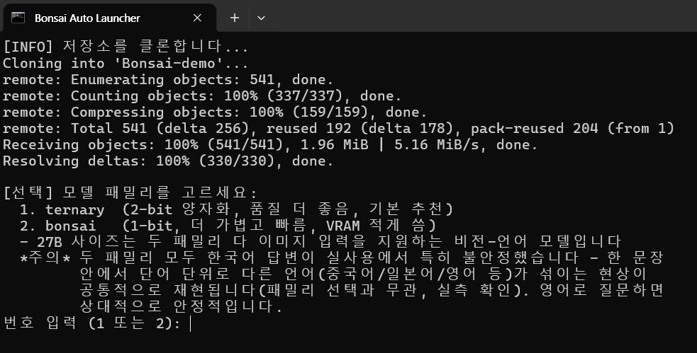
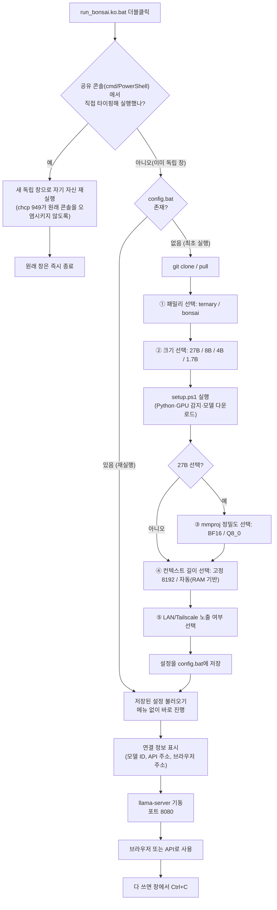
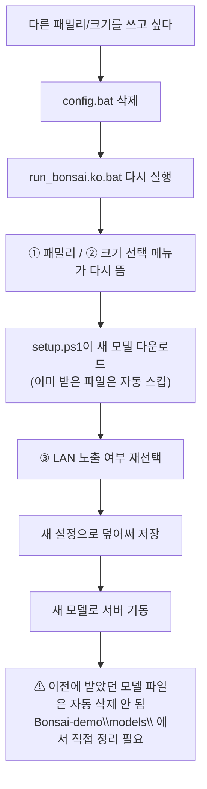

🇺🇸 [English](./README.md) | 🇰🇷 한국어

# Easy-Bonsai

[PrismML-Eng/Bonsai-demo](https://github.com/PrismML-Eng/Bonsai-demo) 로컬 LLM 서버를 더블클릭 한 번으로 설치·실행하는 Windows 배치파일입니다. `git clone` → 모델 선택 → 환경 설치 → 서버 기동까지 전부 자동화합니다.

개발 배경과 트러블슈팅 이력은 [SRS.ko.md](./SRS.ko.md)를 참고하세요. 이 문서는 실사용 가이드입니다.

## 공식 설치 방법과 뭐가 다른가

`Bonsai-demo` 자체 설치 과정도 정상적으로 동작합니다 — 이건 그 과정에서 수동으로 해야 하는 부분을 없앤 것뿐입니다.

| | 공식 설치 방법 | Easy-Bonsai |
| :--- | :--- | :--- |
| 설치 | `git clone` → `cd` → 환경변수 직접 설정 → `.\setup.ps1` → `.\scripts\start_llama_server.ps1`를 직접 타이핑 | 더블클릭 한 번 |
| 모델 선택 | README를 읽고 `$env:BONSAI_MODEL` 등을 직접 설정 | 선택 직전에 VRAM·기능 안내가 뜨는 가이드 메뉴 |
| HF 토큰 프롬프트 | 매번 수동으로 Enter | 자동 스킵 |
| 연결 정보 | 따로 안 보여줌 — 포트/모델 파일명을 이미 알고 있어야 함 | 서버 준비되면 표(API 주소, 브라우저 주소, 모델 ID)로 자동 출력 |
| VRAM 사용량 | 여유 VRAM이 아니라 **시스템 RAM** 기준으로 컨텍스트를 잡음 — 64GB PC면 65536 토큰(27B 약 14GB)이라 16GB 카드에서 부족할 수 있음 | 기본 **고정 8192**(27B 약 10GB) 또는 공식 RAM tier와 같은 **자동** 선택 — 메뉴에서 고르고 `config.bat`에 저장(아래 VRAM 표 참조) |
| mmproj 정밀도(27B) | BF16/Q8_0 선택 불가 — 항상 BF16 | 메뉴로 선택 가능, 재다운로드 없이 언제든 전환 |
| 재실행 | 모든 수동 과정을 반복 | 설정을 기억해뒀다가 바로 시작 |

## 요구 사항

- Windows, git
- (선택) NVIDIA GPU + 최신 드라이버 — 없으면 CPU로 자동 폴백
- (선택) [Tailscale](https://tailscale.com/) — 다른 기기에서 접속하고 싶을 때

## 컨텍스트 길이 vs VRAM (기본값이 8192인 이유)

RTX 5070 Ti(16GB), Ternary-Bonsai-27B(Q2_0), `-ngl 99`(전 레이어 GPU 적재), 유휴 기준선 1220 MiB에서 측정:

| 컨텍스트 선택 | `-c` | GPU 메모리 사용 | 8192 대비 |
| :--- | :--- | :--- | :--- |
| 고정 8192 (기본) | 8192 | 10410 MiB | — |
| 자동 / 공식 RAM 기반 | 65536 | 14079 MiB | **+3669 MiB (약 3.6GB)** |

추가된 약 3.6GB는 순수 KV 캐시입니다(토큰당 약 65.5 KB, 모델 가중치는 두 행 모두 동일). 업스트림의 "자동" 기본값은 **시스템 RAM**(여기선 61GB → 65536)을 기준으로 컨텍스트를 잡고 여유 VRAM은 보지 않기 때문에, 16GB 카드에서는 유휴 기준선이 조금만 높거나 긴 프롬프트가 들어와도 메모리 부족이 날 수 있습니다. 런처의 컨텍스트 메뉴에서 **고정 8192**(안전한 기본값)와 **자동(공식)** 중 고를 수 있습니다.

## 시작하기

`run_bonsai.ko.bat`을 더블클릭하세요. 그 외에는 신경 쓸 게 없습니다 — 모델 패밀리/크기를 고르고, 나머지는 자동으로 진행됩니다.

영어 콘솔 문구로 된 `run_bonsai.bat`도 있습니다(동작은 동일). 편한 언어 쪽을 쓰시면 되고, 모델 답변 자체의 품질은 어느 쪽을 써도 동일합니다 — 아래 FAQ의 언어 관련 항목을 참고하세요.



## 기본 워크플로우



## 연결 정보

서버가 준비되면 창 하단에 아래와 같은 표가 뜹니다 (예시):

```
=========================================
  연결 정보 (서버 준비 완료)
=========================================
  모델 ID       : Bonsai-27B-Q1_0.gguf
  기능          : 이미지 입력 지원(비전)
  API (로컬)    : http://127.0.0.1:8080/v1
  API (LAN/원격): http://100.x.x.x:8080/v1
  브라우저 채팅 : http://100.x.x.x:8080
  API Key       : 필요 없음 (인증 없음)
  컨텍스트 길이 : 8192 토큰 (config.bat의 BONSAI_CTX로 변경 가능)
=========================================
  * 위 브라우저 채팅 주소를 Ctrl + 마우스 왼쪽 클릭하면 바로 열립니다.
  * 이 창을 열어둬야 서버가 계속 유지됩니다. 창을 닫으면 서버도 종료됩니다.
  * 다 쓰셨으면 이 창에서 Ctrl+C 를 눌러 서버를 종료하세요.
```

OpenAI 호환 클라이언트에는 `API` 주소를 Base URL로, `모델 ID`를 모델명으로 넣으면 됩니다. API Key는 인증이 없으니 빈 값을 안 받는 클라이언트라면 아무 문자열이나 넣으세요.

**이 창을 닫으면 서버도 같이 종료됩니다.** 계속 쓰려면 창을 열어두세요.

## 다른 모델로 바꾸고 싶을 때



## 자주 묻는 것

- **VRAM이 부족한 것 같다** — 크기 선택 메뉴에 표시되는 수치는 짧은 대화 기준 최소치입니다. 컨텍스트가 길어질수록 더 필요합니다(자세한 수치는 SRS.ko.md 3.2.2절).
- **비전(이미지 입력)/추론(Thinking) 모드가 필요하다** — 27B에서만 지원됩니다. 8B/4B/1.7B는 텍스트 전용입니다.
- **LAN에서 접속이 안 된다** — Windows 방화벽에서 8080 포트 인바운드를 허용해야 할 수 있습니다.
- **설정을 처음부터 다시 하고 싶다** — `config.bat`만 지우고 다시 실행하세요.
- **mmproj(BF16/Q8_0)를 다시 고르고 싶다** — 전체 재설치 없이 `config.bat`의 `BONSAI_MMPROJ` 값만 `BF16` 또는 `Q8_0`으로 바꾸고 재실행하면 됩니다. 재다운로드 없이 바로 전환됩니다.
- **한국어로 물으면 답변에 다른 언어가 섞여 나온다** — 실사용에서 재현되는 현상이며, **bonsai/ternary 패밀리와 무관하게 공통으로 발생**합니다(패밀리를 바꿔도 해결되지 않음을 확인). 한 문장 안에서 단어 단위로 중국어/일본어/영어 등이 섞여 깨지는 형태로 나타납니다. 영어로 질문하면 상대적으로 안정적이니, 정확한 답변이 중요하면 영어 사용을 권장합니다.

## 라이선스

[MIT](./LICENSE)
