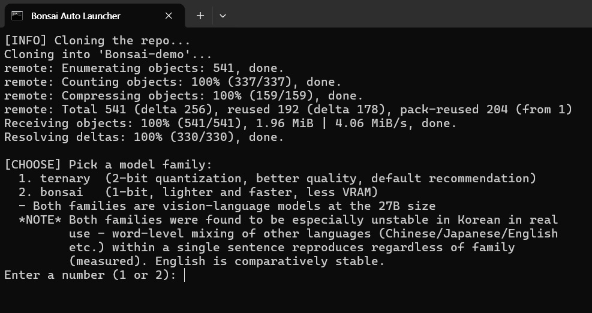
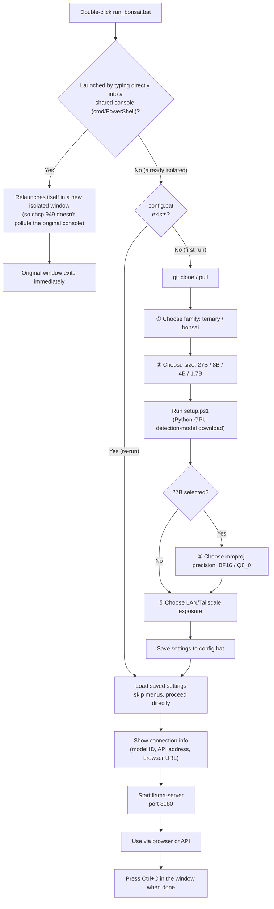
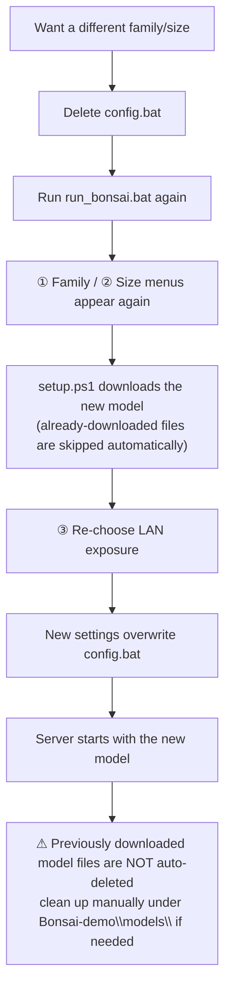

🇺🇸 English | 🇰🇷 [한국어](./README.ko.md)

# Easy-Bonsai

A Windows batch launcher that installs and runs the [PrismML-Eng/Bonsai-demo](https://github.com/PrismML-Eng/Bonsai-demo) local LLM server with a single double-click. It fully automates `git clone` → model selection → environment setup → server startup.

For development background and troubleshooting history, see [SRS.md](./SRS.md). This document is the end-user guide.

## Why not just follow the official steps?

`Bonsai-demo`'s own setup already works — this just removes everything manual about it.

| | Official steps | Easy-Bonsai |
| :--- | :--- | :--- |
| Setup | `git clone` → `cd` → set env vars → `.\setup.ps1` → `.\scripts\start_llama_server.ps1`, typed by hand | Double-click once |
| Choosing a model | Read the README and set `$env:BONSAI_MODEL` etc. yourself | Guided menu, VRAM/feature notes shown right before you choose |
| HF token prompt | Manual Enter every time | Auto-skipped |
| Connection info | Not shown — you have to already know the port/model filename | Auto-printed table (API URL, browser URL, model ID) once the server is ready |
| VRAM usage | Defaults to a 262K-token KV cache regardless of need (~14.1GB idle for 27B) | Capped to 8192 tokens by default (~10.5GB idle for 27B), adjustable in `config.bat` |
| mmproj precision (27B) | No way to choose BF16 vs Q8_0 — always picks BF16 | Menu to choose, switchable anytime with no re-download |
| Re-running | Repeat all the manual steps | Remembers your settings, starts immediately |

## Requirements

- Windows, git
- (Optional) NVIDIA GPU + up-to-date driver — falls back to CPU automatically if absent
- (Optional) [Tailscale](https://tailscale.com/) — if you want to connect from another device

## Measured Performance (for reference)

RTX 5070 Ti (16GB), `BONSAI_CTX=8192`, 27B vision response:

| Family | Generation speed |
| :--- | :--- |
| ternary (2-bit, Q2_0) | ~48-50 t/s |
| bonsai (1-bit, Q1_0) | ~54-59 t/s |

Varies with GPU/driver/context length.

## Getting Started

Double-click `run_bonsai.bat`. That's it — pick a model family/size, and everything else runs automatically.



There's also a Korean-language launcher, `run_bonsai.ko.bat`, with identical behavior but Korean console prompts. Pick whichever matches the language you're comfortable reading; the model itself doesn't get any better or worse for it — see the FAQ note on language quality below.

## Basic Workflow



## Connection Info

Once the server is ready, a table like this appears at the bottom of the window (example):

```
=========================================
  Connection Info (server ready)
=========================================
  Model ID      : Bonsai-27B-Q1_0.gguf
  Feature       : Image input supported (vision)
  API (local)   : http://127.0.0.1:8080/v1
  API (LAN/remote): http://100.x.x.x:8080/v1
  Browser chat  : http://100.x.x.x:8080
  API Key       : Not required (no auth)
  Context length: 8192 tokens (change via BONSAI_CTX in config.bat)
=========================================
  * Ctrl + left-click the Browser chat link above to open it directly.
  * Keep this window open to keep the server running. Closing it stops the server.
  * When you're done, press Ctrl+C in this window to stop the server.
```

For OpenAI-compatible clients, put the `API` address as the Base URL and `Model ID` as the model name. There's no authentication, so if a client won't accept an empty API key field, just put in any placeholder string.

**Closing this window also stops the server.** Keep it open to keep using it.

## Switching to a Different Model



## FAQ

- **VRAM seems insufficient** — The numbers shown in the size-selection menu are minimums for a short conversation. Longer context needs more (see SRS.md section 3.2.2 for details).
- **I need vision (image input) / reasoning (Thinking) mode** — Only supported on 27B. 8B/4B/1.7B are text-only.
- **Can't connect from LAN** — You may need to allow inbound port 8080 in Windows Firewall.
- **I want to redo the setup from scratch** — Just delete `config.bat` and run again.
- **I want to re-pick mmproj (BF16/Q8_0)** — No need for a full reinstall; just change `BONSAI_MMPROJ` in `config.bat` to `BF16` or `Q8_0` and re-run. Switches instantly with no re-download.
- **Answers in Korean mix in other languages** — This is a reproducible issue in real usage, and it happens **regardless of the bonsai/ternary family choice** (confirmed that switching families does not fix it). It shows up as word-level mixing of Chinese/Japanese/English within a single sentence. Asking in English is comparatively stable, so if answer accuracy matters, English is recommended.

## License

[MIT](./LICENSE)
